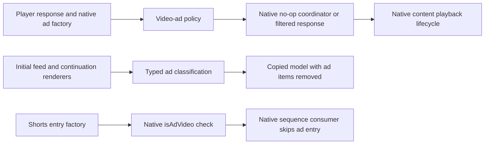

# YouTube ad-block port scheme

Investigation date: 2026-10-04. Inputs: the local ReVanced Android source tree and APK 20.40.45; the original iOS YouTube 21.39.4 arm64 executable; the current RVPort source. This is a proposed implementation, not a newly implemented or device-verified ad blocker. No tests, builds, or app execution were performed for this investigation.

The supported implementation and capture procedure are now documented in [ADBLOCK_IMPLEMENTATION.md](ADBLOCK_IMPLEMENTATION.md). The proposals below retain their research context; unsupported surfaces are explicitly listed in that implementation record.

## Recommended design

Port the behavior through three independent adapters: ordinary-video playback, feed renderers/components, and Shorts sequence entries. Keep `video_ads`, `feed_ads`, and `shorts_ads` independent. Keep creator sponsorship skipping in SponsorBlock; it is not part of YouTube's ad pipeline.

For ordinary videos, replace the current coordinator strategy's `nil` result with **YouTube's native no-op coordinator path**. It preserves native break-completion callbacks. Keep response filtering as the existing default until device reports establish the new coordinator path's behavior. Expand typed feed filtering and cover continuation insertion before importing broader Android component rules. Retain the confirmed Shorts entry-factory filter, with a native `isAdVideo` predicate.

## What Android actually patches

| Source | Mechanism | iOS port consequence |
|---|---|---|
| `ad/video/VideoAdsPatch.kt` and its `Fingerprints.kt` | Locate the void trigger-processing method using two diagnostic strings; inject an early return when `shouldShowAds()` is false. | Port the ad decision point, not Dalvik instructions or register positions. |
| Extension `VideoAdsPatch.java` | `SHOW_VIDEO_ADS` is the inverse of the saved hide-video-ads setting, captured statically. | Preserve on/off behavior; iOS already reads live preferences. Apply changes at a new playback boundary. |
| `ad/general/HideAdsPatch.kt` | Install `AdsFilter`, hide attribution views, suppress the timely shopping shelf, alter Premium offer measurement, close identified fullscreen ad dialogs, filter store-banner list insertion, and hook popup panel IDs. | General ads are several independent UI surfaces, not one player hook. |
| Extension `litho/AdsFilter.java` | Match **identifier or component path**; use protobuf-byte evidence for special cases; protect ordinary home/related videos, comments/replies, and recent-library shelves. | A substring anywhere in a serialized payload is not an equivalent classifier. Keep structural context and exclusions. |
| `HideAdsPatch.kt` request hooks | Change OS name to `Android Automotive` for **browse and search**. | This is an Android client workaround; do not change iOS client identity as the first porting strategy. |

The APK anchor evidence identifies `Lyyp;->t(List)` in `classes2.dex`. Its local JADX decompilation sorts trigger bundles and processes ad activation/ping bindings. This corroborates the Kotlin fingerprint. The Java helper `hideShortsAds()` exists, but the inspected Kotlin tree contains no call/injection reference to that helper. Its presence alone does not establish a shipped Android Shorts suppression path.

Android's additional promotion settings should remain separate from the core ad switches: merchandise, creator/self-sponsor shelves, shopping links, paid-promotion disclosures, Premium promotions, fullscreen interstitials, and popup panels. Do not silently equate all of those with `feed_ads` or existing general-purpose UI hiding switches.

## Current iOS implementation and gaps

The current implementation is in `RVPort.m` (`RVInstallAds`, `RVFilterModel`, `RVInstallFeed`) and `RVExtras.inc` (`RVExtraReject`).

| Existing path | What is established | Gap or consequence |
|---|---|---|
| Response strategy | Empty `playerAdsArray`, `adPlacementsArray`, and `adSlotsArray`; force `isMonetized` and `hasPrerollAds` false. The response descriptor confirms all three repeated fields. | Getter interception leaves underlying protobuf storage and serialization intact. It does not cover every prefetched response, heartbeat, or server-inserted timeline path. |
| Trigger strategy | `YTAdsControlFlowManagerImpl handleActivationForTriggerBundles:` is a real ad-trigger activation point; its adapter calls it directly. | iOS also processes layout exit, expiration, fulfillment, and entry triggers in this method. A blanket return suppresses cleanup as well. Instream-versus-feed ownership is not established by the existing hook. |
| Coordinator strategy | `YTLocalPlaybackController createAdsPlaybackCoordinator` calls the native services factory. | Returning `nil` removes the coordinator contract. Native preroll/postroll completion callbacks matter; the presence of a hook is not proof content resumes. |
| Typed feed models | Copy `contentsArray`, remove three promoted-video renderer types, recurse into `itemSectionRenderer`. | The descriptor contains many additional promoted types and explicit `adSlotRenderer`. Only `loadWithModel:` is hooked; continuation insertion is a separate path. Empty item sections can retain spacing. |
| Elements feed path | `YTIElementRenderer elementData` returns the materialized element payload; the native `emptyCellElementRenderer` builds an actual empty cell element. | Three default substring rules are much narrower than Android's rules, yet their match-anywhere semantics can remove an enclosing ordinary component. There are no Android-style exclusions, surface context, or rule counters. Empty element substitution does not prove outer cell spacing disappears. |
| Shorts | `makeContentModelForEntry:` can return a `YTReelModel`; `videoType == 3` means an ad. | This check is valid, not a wrong-class bug: the factory constructs the subclass. Some other model construction/ad-opportunity paths bypass this factory and remain unverified. |

The three player strategies are currently mutually exclusive. Enabling `video_ads` does not enable all three. Diagnostics currently report installation and preferences, without an ad-specific sequence of decisions and outcomes.

## Verified native evidence that changes the design

Read-only Ghidra research decompiled **33 methods**, resolved 126 Objective-C message stubs, and decoded five additional GPB descriptor tables. The executable identity is `ca9e2f62bdd7fe612f9e7d9f14c395a3c50c9495b572328bd4abd981ed4ec5cf`.

1. **Native no-op coordinator:** `YTRealAdsPlayerServices adsPlaybackCoordinatorWithOverlayManager:delegate:parentResponder:contentPlayerResponse:` reads `contentPlayerResponse.playerData.playerConfig.iosPlayerConfig.useNoOpAdsCoordinator`. When true, it creates `YTNoOpAdsPlaybackCoordinator` with the services registry scope and the original delegate. The GPB descriptor establishes `useNoOpAdsCoordinator` as boolean field **32** on `YTIIosPlayerConfig`.
2. **Completion contract:** the no-op coordinator's `startPrerollAdBreak` calls `adsPlaybackCoordinator:didFinishBreakWithBreakType:` with type **1**; `startPostrollAdBreak` uses type **3**. The local playback receiver handles content-sequence state and finishing playback. Do not recreate this state machine with synthetic timers or pretend ad completion events.
3. **Coordinator selection boundary:** `adsPlaybackCoordinatorForNewPlayback` asks the existing coordinator whether it supports the new response; otherwise it creates another. The no-op implementation returns **false**, so this particular object is reselected at the native new-playback boundary rather than permanently reused.
4. **Separate DAI/live paths:** the same factory checks `isDAICompatible`, discovery slots, live playback, and gapless config when selecting other coordinators. The no-op branch precedes those checks. Therefore forcing it without an eligibility gate would bypass those native selections.
5. **Shorts contract:** `YTReelModel isAdVideo` checks the endpoint's type against **3**. `YTReelDataSource processReelWatchSequenceResponse:withModel:` iterates both next and previous entries, calls `makeContentModelForEntry:`, and only inserts/prefetches/notifies for a non-null result. It also handles continuation tokens and response actions independently. Skipping an ad model here follows an existing nullable return contract.
6. **Typed feed coverage:** `YTIItemSectionSupportedRenderers` has promoted banners/items/app installs/text banners, Sparkles Home/Search/Watch variants, `adsWebViewRenderer`, and `adSlotRenderer` beyond the three current checks. `YTISectionListSupportedRenderers` independently includes `companionAdRenderer` and `adSlotRenderer`.
7. **Continuation boundary:** `YTInnerTubeCollectionViewController addSectionsFromArray:` appends/processes renderers separately from initial `loadWithModel:`. Use this insertion boundary as part of continuation coverage; trace any bypasses rather than claiming all mutations are covered.

Research addresses are retained as provenance in the evidence files. Runtime hooks must use class/selector lookup, target-profile gating, dynamic GPB resolution, and exact Objective-C ABIs. They must never use these unslid addresses as patch offsets.

The principal runtime contracts are:

| Class and selector | Normalized ABI | Role |
|---|---|---|
| `YTRealAdsPlayerServices -adsPlaybackCoordinatorWithOverlayManager:delegate:parentResponder:contentPlayerResponse:` | `@@:@@@@` | Scoped native coordinator selection |
| `YTIIosPlayerConfig -useNoOpAdsCoordinator` | `B@:` (generated; resolve and verify) | Select the built-in no-op branch |
| `YTAdsControlFlowManagerImpl -handleActivationForTriggerBundles:` | `v@:@` | Existing trigger strategy; ownership/lifecycle refinement required |
| `YTInnerTubeCollectionViewController -addSectionsFromArray:` | `v@:@` | Feed append/insertion filtering |
| `YTIElementRenderer -elementData` | `@@:` | Existing serialized-element compatibility path |
| `YTIElementRenderer +emptyCellElementRenderer` | `@@:` | Native empty element construction |
| `YTReelContentModel +makeContentModelForEntry:` | `@@:@` | Nullable Shorts entry construction |
| `YTReelModel -isAdVideo` | `B@:` | Native Shorts ad classification |

The generated flag's ABI is the expected GPB boolean contract inferred from its descriptor, not a static method entry in the inventory. Hook installation must explicitly confirm it after resolution.

## Implementation scheme

### 1. Split policy and instrumentation from hook installation

Add `native/RVAds.inc` and `native/RVAdsDiagnostics.inc`; move only ad-specific logic out of `RVPort.m`. Leave the background-playback gates currently installed in `RVInstallAds` intact. Define a decision result with `allow`, `block`, or `unsupported`, plus a small reason code. Read preferences once per decision and preserve original native behavior for unknown class, signature, response ownership, or content type.

Keep existing saved values `response`, `trigger`, and `coordinator`. Change the implementation behind `coordinator` to the native no-op selection; do not preserve the old `nil` return. Label it clearly in Settings. Keep `response` as default for the first instrumented release. Report requested strategy, actual strategy, and any fallback; do not silently stack incompatible strategies or switch them during an active ad break.

### 2. Ordinary-video coordinator path

Hook the native **services factory**, whose original arguments include the response, delegate, and parent responder. Establish ordinary recorded-watch ownership from those arguments/responder relationships; do not rely solely on `RVCurrentPlayer`, which can still reference the previous video during construction. Require a known player wrapper/raw response and known non-live, non-DAI eligibility. If ownership or the flags are unavailable, pass through and record the reason. Shorts remains governed by `shorts_ads`.

Resolve the generated `YTIIosPlayerConfig useNoOpAdsCoordinator` accessor and verify boolean ABI `B@:`. Within a scoped factory call, override it to true **only for that exact config object on that thread**. Save and restore the previous scope with `@try/@finally` so nested calls are handled. Call the original factory with every original argument. This reuses its own scope, delegate, initialization, and native coordinator construction; it does not mutate a shared cached protobuf or read fixed ivar offsets.

Record whether the getter was actually read and whether the returned class is the native no-op coordinator. Missing config/accessor or another returned coordinator must be reported as unsupported/ineffective, not success. Keep native completion callbacks and the true `isPlayingAd` state; never force the latter false for cosmetic success.

This is the preferred replacement for the existing coordinator strategy. It is **not yet proof of no ad network requests**, nor a port for server-inserted ads already mixed into the content stream.

### 3. Response and trigger paths

Keep the response strategy as a narrowly understood compatibility mode. Record original repeated-array sizes before returning empty arrays. Record separately when original sizes are already zero: an empty response is not evidence a patch blocked an ad. If downstream consumers bypass getters through counts/serialization, trace a player-data consumption boundary and normalize a **copy** using typed setters there. Candidate constructors are `YTPlayerResponse initWithPlayerData:...`; their metadata exists, but their call scope and full normalization contract still need tracing before implementation.

The current response getters are global to `YTIPlayerResponse`. For the revised adapter, bind eligibility to the response object at a proven ownership boundary and apply the same recorded-watch policy; do not infer ordinary playback because an unavailable live flag returns a default false. Unknown ownership passes through. Preserve original ad-state queries and native behavior for responses outside that scope.

Do not clear `streamingData`, playability, video details, content timeline, captions, or tracking context to achieve suppression. Additional ad fields such as prefetched preroll bytes and heartbeat params require consumer evidence before deletion. Getter-emptying alone does not justify arbitrary response surgery.

For `trigger`, first establish manager/slot ownership and the trigger categories required for content progression and cleanup. An instream-owned gate before fulfillment/entry is a candidate; suppressing all exit/expiration processing is not the proposed default. If scope cannot be established, retain response compatibility behavior with an explicit diagnostic fallback. Leave DAI/live, remote playback, and unknown slots native until their state machines are traced.

### 4. Typed feeds, including continuation insertion

Build an explicit renderer allowlist from the **confirmed descriptor fields**, using `has<Field>` presence predicates resolved and ABI-checked at runtime. Begin with the currently supported promoted-video fields, then add the confirmed promoted banners/items/app installs/text/Sparkles variants, ad webviews, companion ads, and ad slots on the correct wrapper classes. Do not classify by every selector containing `ad` or `promo`; metadata, radio items, downloads, Premium account screens, and creator content also contain those words.

Copy only changed GPB messages and wrapper branches. Preserve the original object if there is no change. Preserve sibling order, continuations, headers, tracking, and all unknown fields. Bound recursion, visited objects, and item counts; exceeding a budget passes the unprocessed branch through with a counter. An item section that becomes empty can be collapsed only when it contains no functional continuation/header/other structural purpose; do not discard a continuation merely because its page contained only ads.

Apply the same filter before both existing initial-model hooks and `addSectionsFromArray:`. Filter at the earliest proven point before section controllers calculate indices/layout; do not hide views after the datasource has committed them. Subsequent replace/append command paths are a separate tracing task. Preserve the native ability to request another page when an ad-only continuation contributes no visible items.

### 5. Elements rule parity and layout

Use typed filtering first. For element-only ads, introduce compiled rules with `surface`, `identifier/path`, `payload evidence`, `exceptions`, `setting`, and `reason` fields. Port Android's exclusions for ordinary home/related videos, comments/replies, and recent-library shelves. Port special evidence rules: `statement_banner` requires the Premium growth URL/`SPunlimited` evidence; movie purchase cards require `FEstorefront` and the correct root match. These are distinct promotion settings, not broad ad matches.

`YTIElementRenderer.elementData` alone supplies neither Android's component path nor its match index. Do not import Android's entire pattern list into `feed_patterns`. The current iOS binary's C-string inventory has no matches for the three default ad patterns; those server-supplied identifiers therefore still need runtime/template evidence. Absence from that inventory is not proof the identifiers never occur.

Trace a component-construction boundary that exposes the native identity and parent context. Existing `ELMComponent.key`, `ELMComponent.element`, and `ELMElement.protoText` provide research leads, but are not proof that an arbitrary nested component can be replaced safely. Keep `protoText` as bounded research evidence, not a hot-path full-tree stringify/logging dependency. Classify a component's own identity and intended root before suppressing it; raw matches inside descendants must not blank an enclosing ordinary video/comment.

Use the native empty-cell renderer only for a verified eligible cell root; maintain the existing recursion guard. If a removed ad still leaves a gap, remove its owning model/cell before layout, or trace the native empty-cell sizing contract. Do not globally zero every view containing an attribution label.

### 6. Shorts and optional promotion surfaces

Retain the entry factory filter, use guarded `YTReelModel isAdVideo`, and preserve nonvideo/unknown content. Native next/previous sequence consumers accept null models. Preserve tokens and response actions; filter entries rather than bypassing the whole response processor. Record removed ads and surviving entries separately. Trace direct endpoint construction, watch-time ad opportunities, and other insertion paths before claiming complete Shorts coverage.

Add Android's fullscreen, shopping, popup, Premium, merchandise, and paid-promotion controls only after identifying corresponding iOS renderer/controller contracts. In particular, intercept identified interstitial construction/presentation; do not hook all UIKit alerts or dismiss whichever modal is visible. Removing a paid-promotion disclosure is UI customization, not blocking the sponsored portion of a creator's video.

## Diagnostics and delivery checkpoints

Add an `adblock` section and **Copy ad-block checkpoints** action to Hook diagnostics. Use the existing build fingerprint, bounded history, and passive foreground-snapshot pattern. Protect counters across callback threads; hooks must not force views to load or perform network calls to collect evidence. Do not include URLs, video IDs, full model/protobuf text, credentials, or ad tracking payloads.

| Checkpoint | Record | What a failure tells us |
|---|---|---|
| `profile_and_hooks_ready` | Per-hook ABI/install status, GPB descriptor resolution, build fingerprint | Binary/selector compatibility, rather than an ineffective ad rule |
| `policy_active` | Effective switches, requested/actual strategy, generation, scope gate | A saved setting, strategy, or ownership mismatch |
| `ad_input_observed` | Original array/renderer/entry counts and positive ad classifications | Distinguishes no eligible ad input from suppression that ran |
| `suppression_applied` | Exact fields/types/rules removed; factory getter hit and returned coordinator class | A matched ad that was not intercepted at its real consumer |
| `native_transition_completed` | Real preroll/postroll callbacks and ordinary content-clock progress | Suppression that leaves playback waiting |
| `feed_layout_completed` | Classified/removed/surviving items, continuation insertion, preserved token presence, empty-section outcome | Bypasses, missing pagination, or retained ad spacing |
| `shorts_sequence_completed` | Ad-model skips, surviving models, next/previous generation and content start | A separate insertion route or an empty/broken sequence |
| `unexpected_ad_playback` | True native ad state after an eligible blocked decision | A playback path beyond the proposed adapters |

Use `not_observed`, `unsupported`, and `inconclusive_no_ad_input` outcomes where appropriate. Hook installation is not a success checkpoint for ad removal. A new playback generation must not inherit the previous video's apparent success.

Implement in this order: diagnostics and module extraction; native no-op coordinator; expanded typed feed/continuation filtering; Shorts predicate/counters; structurally scoped Elements rules; additional promotion surfaces. Build/package only when implementation is requested, without running tests. A future release remains unsigned and device-unverified until the user supplies checkpoint reports. Restart/reopen playback or refresh the feed after changing these policies; do not repair an active player by tearing down its coordinator mid-break.

## Evidence and reproduction

- [Compact source/provenance record](profiles/adblock-port-evidence.json).
- [Read-only investigation script](../../analysis/scripts/investigate_adblock.py), run with `python ReVanced/analysis/scripts/investigate_adblock.py` from the workspace root.
- [Native class/selector/ABI metadata](../../patcher/build/adblock-investigation/metadata.json).
- [Selector-annotated decompilation](../../patcher/build/adblock-investigation/decompiled-annotated.txt), [GPB fields](../../patcher/build/adblock-investigation/protobuf-fields.json), and [Ghidra program identity](../../patcher/build/adblock-investigation/identity.txt).
- Existing [Android APK anchors](../../analysis/evidence/android_ad_anchors.json) and [JADX trigger source](../../analysis/evidence/android-yyp.java).

Static evidence establishes where to implement the port and why the current coverage is partial. Ad-free playback, absence of network requests, live/DAI coverage, complete pagination, and runtime layout remain unverified.
