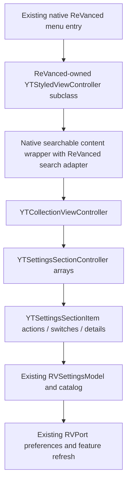

# ReVanced settings UI investigation and repair scheme

Investigated 2026-10-04 against decrypted YouTube 21.39.4 and the five supplied device screenshots. The repair below is implemented and ARM64-built; visual parity and navigation behavior remain unverified on a device. Other ongoing port changes are preserved.

## Implemented repair

`RVSettingsNativeUI.inc` supplies a checked subclass of `YTStyledViewController`, native `YTSettingsCell` rows, section headers and native switches inside an owned collection view. Root/group/map/list pages share `RVSettingsRows.inc` and retain the 114-key preference catalog and validation. Plain UIKit rows remain a capability fallback. Rounded grouped cards and root setting-count subtitles are removed.

The implementation uses the content-level `UISearchBar` option described below, with keyboard-aware constraints. Search never occupies `navigationItem` or hides the native navigation bar. Filtering uses stable preference keys, and Cancel clears the query and restores the root scroll position. Editors use the same styled host and YouTube palette.

The supplied `ReVanced Logo.png` is preserved byte-for-byte at `native/assets/ReVancedSettings.png` and embedded by `build.py`. `RVSettingsIcon.inc` trims transparent padding during rendering and produces a 24-point full-color image. The menu bridge attaches its icon adapter to both the original item's `settingIcon` and the section's `icon`, covering linear and grouped native Settings layouts. The adapter implements `iconImageWithColor:`, `hasIconType` and `iconType`; the target binary's verified multicolor discriminator (0x415) prevents native `updateColors` from forcing template rendering. No fixed-address runtime calls are used.

Video tools remains in the root Settings menu and opens from the styled host. The floating player Tools and RYD boxes are removed; RYD is supplied to verified native dislike text paths and to an inline accessory on positively identified element-backed watch actions.

The historical investigation and design rationale follow. Device verification items are still pending. Further tests are intentionally not run at the user's request.

The current entry is native, but the screen it opens is an Apple Settings-style screen. ReVanced needs a YouTube-styled host, native settings rows, and search outside the navigation bar. The preference model can stay in place.

## Findings and confidence

| Observation | Cause / evidence | Confidence |
|---|---|---|
| Screenshot 1: rounded gray card, black surround, inset separators, uppercase section label | `RVSettingsUI.inc:265`, `:230`, `:252` construct every root/group/map/list page with `UITableViewStyleInsetGrouped`. Cells use UIKit subtitle layout and default section headers. Apple defines this style as inset sections with rounded corners. | Confirmed source choice; matches screenshot |
| Screenshot 1: centered regular title and blue `Settings` text back button; screenshots 4/5: bold leading title and white icon | `RVSettingsController` derives from `UITableViewController`, bypassing `YTStyledViewController`. Native `setupTitleButton`, `updateBackButtonStyle`, and `setupNavigationBarAppearance` install YouTube's title view, custom back control and palette. | Confirmed source and binary difference |
| Screenshot 2: search moves up and title/back disappear | `navigationItem.searchController` is set at `RVSettingsUI.inc:86`; `hidesNavigationBarDuringPresentation` is not set. Its UIKit default is YES. This transition alone is expected UIKit behavior. | Confirmed configuration; explains transition |
| Screenshot 3: search remains over the restored title/back, with unused header space below | UIKit search presentation and YouTube's navigation layout share ownership of the header. `YTNavigationBar -sizeThatFits:` substitutes its `_layoutHeight`; `-layoutSubviews` runs UIKit layout and then rewrites selected foreground view frames. The current page supplies no search presentation/dismissal coordination. | Strong causal explanation, not a reproduced runtime call trace |
| Native dark background does not match the custom table's black surround / system cell colors | `applyAppearance` only sets interface style. `UIColor.secondaryLabelColor`, stock cell/table colors and UIKit fonts do not read YouTube's palette or type styles. Existing palette hooks in `RVExtras.inc` affect named YouTube palette getters, not stock UIKit table colors. | Confirmed source difference |
| Native switches have different shape/color from stock `UISwitch` | Current page constructs `UISwitch` with no YouTube styling. Native `YTSettingsCell -setSwitchVisible:` creates `ABCSwitch`; `-updateColors` applies `YTColor +staticBlue` and the native theme. | Confirmed binary path; current switch appearance was not pictured |
| Previous verification passed without detecting the problem | `tests/settings.m` includes the preference model and menu bridge, with Foundation/native-shaped fixtures; it does not include or render `RVSettingsUI.inc`. | Confirmed test scope |

The screenshots establish a visual defect and a bad restored search layout. They do not identify the exact UIKit private subview whose frame is wrong. Do not present this as a proven iOS version regression or a preference-catalog problem. A device view-hierarchy capture before search, during search and after cancellation would identify the final frame writer if a small compatibility patch is pursued.

The native menu bridge successfully opens the screen. Changing category ordering, the authentication hooks, or Android patch logic will not fix these rendering choices. The local Android settings patch itself explicitly matches stock YouTube colors and removes preference dividers; its categories/data are useful inputs, but its layouts are not iOS UI components.

## Native components verified in this binary

The research ran Ghidra headless with `-readOnly -noanalysis` against the supplied project. It selected 31 methods plus two block bodies and one frame-setting helper. The Ghidra program identity and extracted executable both report SHA-256 `ca9e2f62bdd7fe612f9e7d9f14c395a3c50c9495b572328bd4abd981ed4ec5cf`. Addresses below are research anchors, never runtime call addresses.

| Component / method | Address | Verified behavior |
|---|---|---|
| `YTSettingsViewController -loadView` | `0x101455054` | Creates `YTCardCollectionViewUIFormatter` (positioning style 2), `YTCollectionViewController`, native background palette and a safe-area wrapper; optionally uses the native searchable settings wrapper |
| `-layoutForCollectionViewController` | `0x101456894` | Uses `YTSeparatorCollectionViewFlowLayout`, with a native section layout delegate |
| `YTStyledViewController -initWithParentResponder:` | `0x10027a6b4` | Initializes native layout/color style, title button/title view, responder relationship and `edgesForExtendedLayout = 0` |
| `-viewDidLoad` / `-viewWillAppear:` | `0x1003dafe8` / `0x1003dc854` | Installs title styling and updates title geometry, shadow, back control and navigation appearance |
| `-setupTitleButton` | `0x1003db030` | Uses YouTube type styles and layout alignment; installs `YTNavigationBarTitleView` as `navigationItem.titleView` |
| `-updateBackButtonStyle` | `0x1003dce38` | Uses YouTube back-button helpers and native foreground color |
| `-setupNavigationBarAppearance` | `0x1043f0f68` | Applies native header/title colors; sets native bar nontranslucent; updates custom controls |
| `YTSettingsCell -initWithFrame:` | `0x10186a468` | Creates native title, formatted description and separate trailing detail labels |
| `-setSwitchVisible:` / `-updateColors` | `0x10186af94` / `0x10186c014` | Creates `ABCSwitch`; uses native blue, palette, selection color and theme |
| `+preferredSizeForEntry:size:withPadding:` | `0x10186b300` | Measures text and accessories; description height and available width participate in row sizing |
| `+customCellPadding` | `0x10186bb54` | Returns 13 points; do not infer a universal fixed row height from this |
| `YTSettingsSectionController -updateSettingsCell:withItem:` | `0x10186e428` | Maps item title/summary/detail blocks, enabled state, switch callbacks, icon and updated color flag onto native cells |
| `YTSettingsSectionItem +switchItemWithTitle:titleDescription:accessibilityIdentifier:switchOn:switchBlock:` | `0x10186f53c` | Factory forwards to native switch constructor, which wraps callbacks and maintains item state |
| `YTSettingsCell -didToggleSwitch` and native switch wrapper | `0x10186c4a4` / `0x10186f738` | Pass source cell and requested state to the callback; callback result controls acceptance and rollback |
| `YTSearchableSettingsViewController -initWithCollectionViewController:parentResponder:` | `0x101458614` | Creates `YTSearchBoxView` and `YTSearchableCollectionWrapperView`; search is part of the content hierarchy |
| `-searchBoxView:didSearchText:` | `0x1014589e0` | Filters stored section items by title only and replaces collection sections; this default is insufficient for existing ReVanced search |
| `YTSearchableCollectionWrapperView -layoutSubviews` | `0x10145a9a8` | Measures search view and places collection beneath it |
| `YTSearchBoxView -layoutSubviews` / `-didTapCancelButton` | `0x10145985c` / `0x10145a270` | Lays out a 48-point search content area and cancel control; cancellation loses focus and calls delegate |
| `YTNavigationBar -sizeThatFits:` / `-layoutSubviews` | `0x1043fddd4` / `0x10031c1d8` | Overrides height after UIKit measurement and performs additional frame layout |
| `-foregroundSubviews` | `0x10031c6b4` | Selects subviews containing native navigation controls/title views or UIButtons for the additional layout pass |
| Native settings appearance animation block | `0x101455a54` | Calls `setupNavigationBarAppearance` only when the top controller is a `YTStyledViewController` |

Raw decompiler argument declarations are unreliable for some Objective-C calls and returned structs. Use extracted method encodings and, where needed, ARM64 instructions/block signatures when implementing. A method encoding containing `@?` does not specify the callback's argument or return types.

## Recommended design

Use a ReVanced-owned native styled host and native section models. Do not instantiate a second normal `YTSettingsViewController` and let it request/rebuild Google's settings: those controllers contain account, network, category routing and split-view behavior that the patch preference screen does not need.

### 1. Host and navigation

Register a dedicated runtime subclass of `YTStyledViewController` after validating the superclass, initialization/lifecycle method ABIs and UIViewController ancestry. Use `objc_allocateClassPair`/`class_addMethod` and associated ReVanced state, avoiding a hard link against app-private class symbols. Keep super dispatch correct and invoke native lifecycle methods once. Initialize through `initWithParentResponder:` rather than the plain UIViewController initializer, so native style/title state exists.

Set the title through the inherited native title path. Let the inherited title/back layout run. A ReVanced group page should look like **General**: leading white back icon and bold leading title. The root reached from Settings should have a back icon; the separately presented fallback should have a close icon. Preserve the existing `showOrPushViewController:` entry route for YouTube's split layouts. Give nested pages an explicit route through the same host/navigation context rather than assuming a navigation controller always exists.

Do not replace YouTube's navigation delegate or mutate global `UIAppearance`. A modal fallback should use a validated native navigation container when available, with an explicit close action. Native styled host behavior in that standalone container must be tested; superclass reuse alone does not prove modal/split correctness.

### 2. Rows, groups and tools

Create `YTCollectionViewController` and native layout/formatter instances using the contracts from native `loadView`. Correctly contain child controllers with `addChildViewController`, view insertion, then `didMoveToParentViewController`. Use the native horizontal safe-area wrapper or equivalent explicit constraints. Collection sections belong only to this host.

Generate native `YTSettingsSectionItem` objects from `RVPreferencesCatalog`, grouped into native `YTSettingsSectionController` arrays:

| Existing item | Native mapping |
|---|---|
| Root group | Action item with title, optional secondary count and selection callback |
| Boolean preference / category membership | Native switch factory with title, description, accessibility ID and current value |
| Choice / scalar preference | Action item with description and `detailTextBlock` for trailing current value |
| Per-item override | Native member title and trailing `Default`/current value; callback edits the same map |
| Tools / import / export / reset / diagnostics / About | Native action rows retaining their current behavior |

Root rows should use the flat YouTube pattern, with no enclosing rounded card and no per-row UIKit separators. Use normal-case native section headers. Keep descriptions below row titles and values in the native trailing detail area, as **Appearance / Use device theme** in screenshot 5. Optional root setting counts should not determine the styling or force tall subtitle rows. If group icons are desired, use verified native icon models; do not reuse Android drawable IDs or guess iOS icon enum values.

Select `useUpdatedSettingsColors` consistently with the analyzed native settings construction/feature state. Measure cells through native size methods. Implement required section separator/inset delegate methods with ABI-correct struct returns, taking screenshot 4's section-level divider as the reference. Verify root/group layout separately; switching table style alone does not reproduce these cells.

Switch callbacks must return success/failure and accept the source cell and requested Boolean state. Verify the exact block ABI before coding the adapter; the existing entry's `(id, NSUInteger) -> BOOL` selection callback is not a switch callback. Save with `RVSavePreference`, call `RVPreferencesChanged` after success, and keep the model/cell in agreement on failure. Use weak host captures to avoid a host -> item -> callback -> host cycle. Build rows from effective values again after import, reset, map/list edits and theme changes.

### 3. Search with one owner of geometry

Remove `navigationItem.searchController` from ReVanced hosts. Embed native search in the content wrapper below the native header. Its height comes from native measurement and safe areas, never a hardcoded screenshot offset. Search activation should not hide, relocate or restore the navigation bar. This removes the conflicting transition rather than applying a delayed frame correction.

Prefer a ReVanced-owned runtime subclass/adapter around `YTSearchableSettingsViewController` so native search entry creation, focus, cancel layout and scroll behavior can be reused. Override only ReVanced-owned instances' search/cancel callbacks. The remaining search entry/focus/scroll lifecycle contracts must be checked before implementation; the research confirms the construction/layout pattern, not a completed adapter.

Retain `RVSearchPreferences`: it searches all 113 preferences by title, group and hint. Native default search examines only the stored rows' titles; wrapping the root's 13 group rows would silently reduce search coverage. Feed matched preference keys into the same item generator used by detail pages. Show group context for results. Never map a filtered index back to the unfiltered array.

Maintain explicit states:

| State | Header / search / content |
|---|---|
| Idle | Native header fixed; search below it; root groups/tools visible |
| Editing empty query | Same geometry; cancel available; keyboard visible; groups/tools visible |
| Editing nonempty query | Same geometry; matching native preference rows or clear empty-result message |
| Return / keyboard dismissed | Preserve query/results; only keyboard geometry changes |
| Cancel | Clear query and results, resign focus, hide cancel, restore groups/tools and saved root scroll position |
| Result opens a detail/editor | End editing; pass selected key into destination; retain query/scroll state for return |
| Back to YouTube Settings / close fallback | End editing; release owned search/child state; native Settings header restores normally |

Keep the native wrapper/layout as the sole owner of the search/collection vertical split. Handle keyboard avoidance once, using the verified collection keyboard-inset facility or owned constraints, not both. Deactivate/end editing before presenting pickers or pushing editors. The existing special case that presents alerts from `UISearchController` should be replaced with the actual host presenter after this migration.

If native search entry/lifecycle proves impractical, a standalone `UISearchBar` with a delegate in the same content wrapper is a reasonable fallback. It must not be installed in `navigationItem`, must use YouTube colors and must have the same state behavior. This fallback trades exact native search styling for simpler ownership; it does not justify keeping inset-grouped rows.

### 4. Appearance and editors

Use YouTube page-style and palette/type-style paths for host, collection, cells, description/detail text, native switches and search. Inherit the app's current appearance when the ReVanced theme is native/default; propagate an explicit dark/light override into the owned native page-style path. Setting only UIKit `overrideUserInterfaceStyle` is insufficient for YouTube's custom palette. Verify dark/light page-style enum meanings for the supported binary instead of inferring them from UIKit enums.

Honor existing custom background settings through the already hooked palette getters. Refresh owned native rows/header on appearance changes and on return from an editor. Do not recolor unrelated native screens as part of this repair.

Move the text/import editor into the same styled host, with an accessible Save action and keyboard-aware content. Evaluate `YTSettingsTextViewController` separately if reused: a factory match does not establish bounded multiline/import validation behavior. Keep existing validation and error handling. Native picker rows/checkmarks can replace short action-sheet choices after their delegate/callback contracts are verified; this is a follow-up to the root/group/search repair, not a prerequisite for retaining working value editing.

## Implementation sequence and boundaries

1. **Add an adapter layer** (proposed `RVSettingsNativeUI.inc`) for checked native classes/selectors, owned host state, row/section generation, presentation and capability reporting. Keep the menu bridge and preference model as shared dependencies. Add no fixed-address calls.
2. **Prove a minimal native page**: ReVanced title/back plus one action, one switch, one trailing-value row. Verify native geometry, callback success/rejection, appearance and root/group return on the target phone before expanding to every preference.
3. **Move all groups and tools** to the adapter; preserve the 113-key catalog and existing storage/import/reset semantics. Route map/list/detail/text pages through the same host presentation helper.
4. **Add content search** and run repeated search/cancel/push/pop sequences. Remove old `UISearchController` presentation special cases only when destinations use the new host.
5. **Finish theme/editor consistency**, build ARM64, run existing host tests and hook checks, package a separately versioned IPA, then verify on device. Do not overwrite older artifacts or reset user defaults to make screenshots look clean.

For incompatible native APIs, retain a usable scoped UIKit fallback with a plain table, explicit YouTube-like colors/rows and content-owned search. Log which native capability was missing. Do not silently fail to open settings or globally patch navigation-bar frames. Validate native construction before selecting the native route, and do not mix incomplete native sections with UIKit search in one host.

Minimal containment workaround if shipping before migration: set `hidesNavigationBarDuringPresentation = NO`, dismiss search before leaving/pushing, and move search into an owned content header if the overlap persists. This addresses the immediate transition risk but still requires device verification; it does not solve font, cell, switch or palette parity. Avoid timers, manually forcing the search frame, fixed top insets, or global hooks to `YTNavigationBar -layoutSubviews`.

## Verification that will catch this defect

Existing Foundation tests remain useful for storage and bridge regressions. Extend native-shaped adapter fixtures for row generation and selector/block contracts, including accepted/rejected switch changes, filtered-key mapping, missing capability fallback and callback lifetime. Static metadata checks must include new dynamic selectors/factories; the current direct hook count does not cover them.

Actual YouTube UI validation needs the signed app on the supplied target. Stock-UIKit sample/simulator screenshots cannot prove private YouTube components lay out correctly.

Device acceptance:

- Root/group/map/list/text screens have a native leading title/back or close control, matching background/typography and flat rows. Descriptions wrap without colliding with switches/values.
- Tap search, type, clear, press Return and cancel at least ten times, including rapidly. Each cancellation returns to the same header/search bounds and restores groups/tools; no overlap or residual empty header area.
- Search by a title, a group name and a word found only in a description. Results cover the catalog; empty/whitespace query restores root; zero matches has a visible empty state.
- Toggle from search, change a value from search, open a map/list/text editor, return, then back to native Settings and General. Neither search nor header styling leaks into the next screen.
- Switch failure rolls back, successful changes persist after relaunch, import/reset refresh all visible values, and Copy configuration remains CLI-compatible.
- Test device theme, explicit dark/light, custom background, larger text, VoiceOver, supported rotation and keyboard appearance/disappearance. Test native entry and three-finger modal fallback separately; test split presentation when available.
- Capture the host/navigation/search/table-or-collection bounds, safe-area/adjusted insets, query/focus state and native capability status at idle/editing/cancelled states. Keep diagnostic UI data separate from credentials.

The repair is implemented using the verified native host, cell model, switch and appearance contracts. The exact original overlap call sequence and final visual parity remain device verification items.

## Evidence and reproduction

- Current implementation: `native/RVSettingsUI.inc`, `native/RVSettingsBridge.inc`, `native/RVSettingsModel.inc`, `native/RVExtras.inc`.
- Original design and menu routing evidence: [SETTINGS_SCHEME.md](SETTINGS_SCHEME.md), [profiles/settings-evidence.json](profiles/settings-evidence.json).
- This investigation's compact receipt: [profiles/settings-ui-evidence.json](profiles/settings-ui-evidence.json).
- Local workspace script: `ReVanced/analysis/scripts/investigate_settings_ui.py`.
- Local research output: `ReVanced/patcher/build/settings-ui-investigation/` (`identity.txt`, `metadata.json`, `decompiled.txt`, `annotated.txt`, `selectors.json`, `hashes.json` and Ghidra logs). These are generated workspace evidence, not released runtime code.
- Reproduce from the workspace root: `python ReVanced/analysis/scripts/investigate_settings_ui.py`. It reads the existing project and does not save project changes.
- Android comparison: local `revanced-patches-main/patches/src/main/kotlin/app/revanced/patches/youtube/misc/settings/SettingsPatch.kt`, especially theme override and divider removal.
- UIKit style definition: [Apple: insetGrouped](https://developer.apple.com/documentation/uikit/uitableview/style-swift.enum/insetgrouped).
- Search default/transition contract: [Apple: hidesNavigationBarDuringPresentation](https://developer.apple.com/documentation/uikit/uisearchcontroller/hidesnavigationbarduringpresentation).

The implementation changes settings presentation and its menu icon. It adds no authentication changes or release-version increment. The packaged IPA is unsigned and has not been device-validated.
